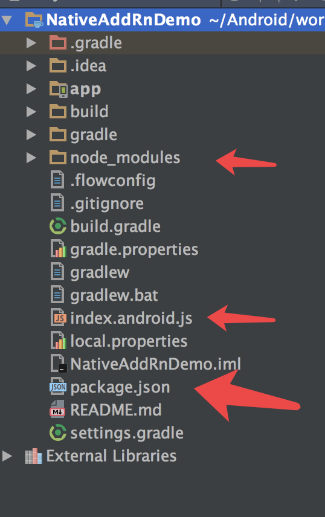
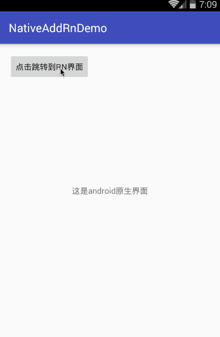
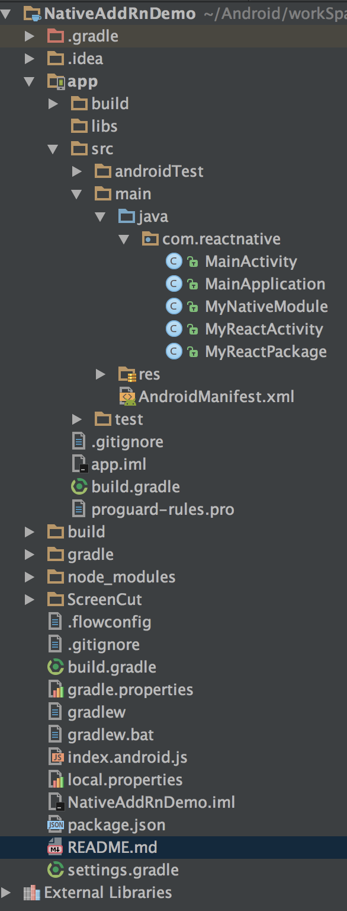

## Android原生项目接入RN

### 发现今年React Native发展的挺好了，已经有很多公司开始使用RN来开发，我看慕课网也出了好多RN的视频以及实战课程。之前我也自学了RN，感觉上手入门还是挺快的，也打算继续学习下去。下面开始切入正题：

> 假如你的Android原生项目已经写了很多，接下来想使用RN实现一些页面功能，那么该怎么接入呢，其实React Native中文网也有参考，但是我当时按照那篇文章来操作还是有些问题的，感觉不适合初学者来使用，接下来我打算记录一些我自己的接入过程。希望能给一些正在搞这个的朋友作出一些参考

#### 接入的前提条件：

  *  **已有Android原生的工程**
  *  **RN环境已经搭建好**

#### 本篇文章的所记录的知识点有：

  * **Android工程加载RN页面**
  *  **RN来调用原生的方法，如果需要返回结果，则可以回调**

#### 先大致浏览一下，接入RN之后Android工程的样子：




### 接下来开始实现接入

  * 步骤一： 用android studio打开已经创建好的Android工程，然后在Terminal中执行一下命令：

      1. npm init
      2. npm install --save react
      3. npm install --save react-native
      4. curl -o .flowconfig https://raw.githubusercontent.com/facebook/react-native/master/.flowconfig


  > 说明，在创建 npm init的时候，需要输入name、version等值，这里可以随意先输入一下，貌似在输入name的值只能用英文的小写字母表示，其实这个无所谓的，可以将其他的React Native工程中的package.json文件Copy过来，将里面的name等值改一下就ok了，还省事。 其他3个命令，依次敲回车执行即可。然后再从React Native工程中Copy一份index.android.js,注意的是，需要将`AppRegistry.registerComponent('RNComponent', () => RNComponent);` 将第二个RNComponent中的name值保持一致（这个名字可以起别的也行）

  * 步骤二：这样React Native的工作差不多完成了，然后Android端需要创建一个Activity来装载所有的RN页面，这里我创建了MyReactActivity。在创建之前，需要在Android中添加一些依赖，否则用到一些类找不到，下面先开始配置Android工程

    > step1. 在整个工程的build.gradle中添加 :

    ```
    allprojects {
            repositories {

                mavenLocal()
                jcenter()
                maven {
                    // All of React Native (JS, Obj-C sources, Android binaries) is installed from npm
                    url "$rootDir/node_modules/react-native/android"
                }
            }
        }

        task clean(type: Delete) {
            delete rootProject.buildDir
        }
    ```

    > step2. 在moudle的build.gradle中添加`compile "com.facebook.react:react-native:+"` 具体参考我的builde.gradle配置，如下所示

    ```
    android {
        compileSdkVersion 25
        buildToolsVersion "25.0.2"
        defaultConfig {
            applicationId "com.reactnative"
            minSdkVersion 16
            targetSdkVersion 25
            versionCode 1
            versionName "1.0"
            testInstrumentationRunner "android.support.test.runner.AndroidJUnitRunner"
        }

        splits {
            abi {
                reset()
                enable true
                universalApk true  // If true, also generate a universal APK
                include "armeabi-v7a", "x86"
            }
        }
        buildTypes {
            release {
                minifyEnabled false
                proguardFiles getDefaultProguardFile('proguard-android.txt'), 'proguard-rules.pro'
            }
        }
        configurations.all {
            resolutionStrategy.force 'com.google.code.findbugs:jsr305:3.0.0'
        }
    }

    dependencies {
        compile fileTree(dir: 'libs', include: ['*.jar'])
        androidTestCompile('com.android.support.test.espresso:espresso-core:2.2.2', {
            exclude group: 'com.android.support', module: 'support-annotations'
        })
        compile 'com.android.support:appcompat-v7:25.0.1'
        testCompile 'junit:junit:4.12'

        compile "com.facebook.react:react-native:+"  // From node_modules
    }

    ```


  * 紧接着上面的步骤二，开始创建MyReactActivity，代码如下；

```
import com.facebook.react.ReactActivity;

public class MyReactActivity extends ReactActivity{

    @Override
    protected String getMainComponentName() {
        return "RNComponent";
    }
}
```

> 还有一种创建方式，就是下面这样的，其中这两种创建的MyReactActivity都是可以的，因为ReactActivity也是实现DefaultHardwareBackBtnHandler接口。

```
public class MyReactActivity extends Activity implements DefaultHardwareBackBtnHandler {
    private ReactRootView mReactRootView;
    private ReactInstanceManager mReactInstanceManager;

    @Override
    protected void onCreate(Bundle savedInstanceState) {
        super.onCreate(savedInstanceState);

        mReactRootView = new ReactRootView(this);
        mReactInstanceManager = ReactInstanceManager.builder()
                .setApplication(getApplication())
                .setBundleAssetName("index.android.bundle")
                .setJSMainModuleName("index.android")
                .addPackage(new MainReactPackage())
                .setUseDeveloperSupport(BuildConfig.DEBUG)
                .setInitialLifecycleState(LifecycleState.RESUMED)
                .build();


        mReactRootView.startReactApplication(mReactInstanceManager, "RNComponent", null);

        setContentView(mReactRootView);
    }

    @Override
    public void invokeDefaultOnBackPressed() {
        super.onBackPressed();
    }
}
```

  * 接下来开始创建 MainApplication，代码如下

```

public class MainApplication extends Application implements ReactApplication {

  private final ReactNativeHost mReactNativeHost = new ReactNativeHost(this) {


    @Override
    public boolean getUseDeveloperSupport() {
      return BuildConfig.DEBUG;
    }

    @Override
    protected List<ReactPackage> getPackages() {
      return Arrays.<ReactPackage>asList(
          new MainReactPackage()
          //将我们创建的包管理器给添加进来

      );
    }
  };

  @Override
  public ReactNativeHost getReactNativeHost() {
      return mReactNativeHost;
  }

  @Override
  public void onCreate() {
    super.onCreate();
    SoLoader.init(this, /* native exopackage */ false);
  }
}
```

 * ok,最后在AndroidManifest文件中，添加一些权限，以及声明MainApplication跟MyReactActivity

```
<manifest xmlns:android="http://schemas.android.com/apk/res/android"
          package="com.reactnative">

    <uses-permission android:name="android.permission.INTERNET"/>
    <uses-permission android:name="android.permission.SYSTEM_ALERT_WINDOW"/>
    <uses-permission android:name="android.permission.SYSTEM_OVERLAY_WINDOW"/>

    <application
        android:name=".MainApplication"
        android:allowBackup="true"
        android:icon="@mipmap/ic_launcher"
        android:label="@string/app_name"
        android:supportsRtl="true"
        android:theme="@style/AppTheme">
        <activity android:name=".MainActivity">
            <intent-filter>
                <action android:name="android.intent.action.MAIN"/>

                <category android:name="android.intent.category.LAUNCHER"/>
            </intent-filter>
        </activity>


        <activity
            android:name=".MyReactActivity"
            android:configChanges="orientation|screenSize"
            android:theme="@style/NoActionBar"
            />

        <activity android:name="com.facebook.react.devsupport.DevSettingsActivity"/>


    </application>

</manifest>
```

> 这里需要说明一下，在声明MyReactActivity的时候，需要给它指定一个没有ActionBar的样式，在styles.xml中作修改：
```
  <style name="NoActionBar" parent="Theme.AppCompat.Light.NoActionBar">
        <!-- Customize your theme here. -->
        <item name="colorPrimary">@color/colorPrimary</item>
        <item name="colorPrimaryDark">@color/colorPrimaryDark</item>
        <item name="colorAccent">@color/colorAccent</item>
    </style>
```

### 到此为止，不出意外，一般都能正常加载RN页面，效果如下：




### 到这里 简单的接入已经完成了，但是正常项目中，接入RN之后，RN肯定还要调用原生的一些方法，并且希望能拿到结果。比方说，RN想要得到系统相册某些图片的路径，那么Android端就能提供查找的方法，并且将这个结果回调给RN

### 接下来开始实现 交互的过程

  * 第一步，需要写个类来继承ReactContextBaseJavaModule

```
package com.reactnative;

import android.content.Context;
import android.text.TextUtils;
import android.widget.Toast;
import com.facebook.react.bridge.Callback;
import com.facebook.react.bridge.ReactApplicationContext;
import com.facebook.react.bridge.ReactContextBaseJavaModule;
import com.facebook.react.bridge.ReactMethod;
import com.facebook.react.uimanager.IllegalViewOperationException;

public class MyNativeModule extends ReactContextBaseJavaModule {

    private Context mContext;

    public MyNativeModule(ReactApplicationContext reactContext) {
        super(reactContext);

        mContext = reactContext;
    }

    @Override
    public String getName() {

        //返回的这个名字是必须的，在rn代码中需要这个名字来调用该类的方法。
        return "MyNativeModule";
    }

    //函数不能有返回值，因为被调用的原生代码是异步的，原生代码执行结束之后只能通过回调函数或者发送信息给rn那边。

    @ReactMethod
    public void rnCallNative(String msg) {

        Toast.makeText(mContext, msg, Toast.LENGTH_SHORT).show();
    }

    /**
     * 创建给js调用的方法 将网络请求的结果以回调的方式传递给js
     *
     * @param url
     * @param callback
     */
    @ReactMethod
    public void getResult(String url, final Callback callback) {
        new Thread(new Runnable() {
            @Override
            public void run() {
                try {
//                    模拟网络请求数据的操作
                    String result = "我是请求结果";
                    callback.invoke(true, result);

                } catch (Exception e) {

                }
            }
        }).start();
    }

    @ReactMethod
    public void tryCallBack(String name, String psw, Callback errorCallback, Callback successCallback) {
        try {
            if (TextUtils.isEmpty(name) && TextUtils.isEmpty(psw)) {
                // 失败时回调
                errorCallback.invoke("user or psw  is empty");
            }
            // 成功时回调
            successCallback.invoke("add user success");
        } catch (IllegalViewOperationException e) {
            // 失败时回调
            errorCallback.invoke(e.getMessage());
        }
    }

    /**
     * 回调给android端的数据
     *
     * @param callback
     */
    @ReactMethod
    public void renderAndroidData(Callback callback) {
        callback.invoke("android data");
    }
}
```

> 说明，这里第一个需要注意的地方是getName()方法，返回的这个别名，将来在RN的js中需要用到这个别名来调原生的方法。第二个地方，凡是需要RN调用的方法，都需要加`@ReactMethod` 注解。第三个地方，原生提供的方法的返回值类型都是void类型，比较简单的如`rnCallNative(String msg)` , RN那边调用，就是吐司一下。如果需要返回结果就需要回调，如`renderAndroidData(Callback callback)`

### ok，原生方法算是写好了，接下来需要创建一个类来实现ReactPackage，将我们创建的类添加进原生模块列表中。如下所示：

```
public class MyReactPackage implements ReactPackage {

    @Override
    public List<NativeModule> createNativeModules(ReactApplicationContext reactContext) {

        List<NativeModule> modules = new ArrayList<>();
        //将我们创建的类添加进原生模块列表中
        modules.add(new MyNativeModule(reactContext));
        return modules;
    }


    @Override
    public List<Class<? extends JavaScriptModule>> createJSModules() {

        //返回值需要修改
        return Collections.emptyList();
    }


    @Override
    public List<ViewManager> createViewManagers(ReactApplicationContext reactContext) {

        //返回值需要修改
        return Collections.emptyList();
    }
}
```

#### 还需要在MainApplication中，将我们创建的包管理器给添加进来 ，如下所示：

```
public class MainApplication extends Application implements ReactApplication {

    private final ReactNativeHost mReactNativeHost = new ReactNativeHost(this) {


        @Override
        public boolean getUseDeveloperSupport() {
            return BuildConfig.DEBUG;
        }

        @Override
        protected List<ReactPackage> getPackages() {
            return Arrays.<ReactPackage>asList(
                    new MainReactPackage(),
                    //将我们创建的包管理器给添加进来
                    new MyReactPackage()
            );
        }
    };

    @Override
    public ReactNativeHost getReactNativeHost() {
        return mReactNativeHost;
    }

    @Override
    public void onCreate() {
        super.onCreate();
        SoLoader.init(this, /* native exopackage */ false);
    }
}
```

> 这样的话，原生模块算是写好了，接下来RN来调用Native方法，将index.android.js中可以这样调用：

  * 首先 import { NativeModules} from 'react-native';

  * 调用原生方法可以这么去写` NativeModules.MyNativeModule.rnCallNative('调用原生方法的Demo');`

#### 展示 index.android.js 全部代码；

```
export default class RNComponent extends Component {

    // 构造
    constructor(props) {
        super(props);
        // 初始状态
        this.state = {
            title: '',
        };
    }

     render() {
             tryCall = () => {
                 var rnToastAndroid = NativeModules.MyNativeModule;
                 rnToastAndroid.tryCallBack("luo", "131", (errorCallback) => {
                         alert(errorCallback)
                     },
                     (successCallback) => {
                         alert(successCallback);
                     });
             };
             androidback = () => {

                 var ANdroidNative = NativeModules.MyNativeModule;
                 ANdroidNative.renderAndroidData((Callback) => {
                     alert(Callback);

                 });
             };

             return (

                 <View style={styles.container}>
                     <Text style={styles.welcome}
                           onPress={this.call_button.bind(this)}
                     >
                         React Native 调用原生方法!
                     </Text>
                     <Text style={styles.instructions}
                           onPress={()=>androidback()}
                     >
                         获得android回调的数据
                     </Text>
                     <Text style={styles.instructions}>

                         {NativeModules.MyNativeModule.rnCallNative(this.state.title)}
                     </Text>

                     <Text style={styles.instructions} onPress={()=>tryCall()}>
                         trycallAndroid
                     </Text>
                 </View>
             );
         }

         call_button() {

             NativeModules.MyNativeModule.rnCallNative('调用原生方法的Demo');
         }

}
const styles = StyleSheet.create({
    container: {
        flex: 1,
        justifyContent: 'center',
        alignItems: 'center',
        backgroundColor: '#F5FCFF',
    },
    welcome: {
        fontSize: 20,
        textAlign: 'center',
        margin: 10,
    },
    instructions: {
        textAlign: 'center',
        color: '#333333',
        marginBottom: 5,
    },
});

AppRegistry.registerComponent('RNComponent', () => RNComponent);

```

### 看看整个工程目录：



### 最后运行效果：


### 到此为止，Native接入RN，以及与RN的交互基本上介绍完了，如果还不是很明白，请下载demo


