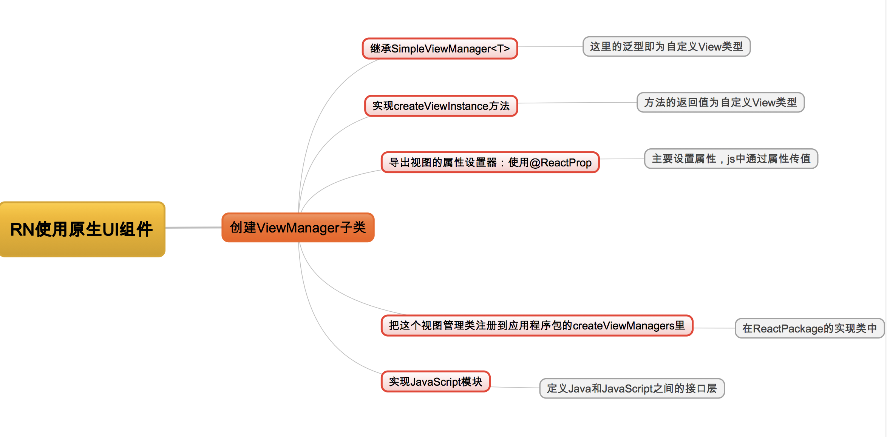
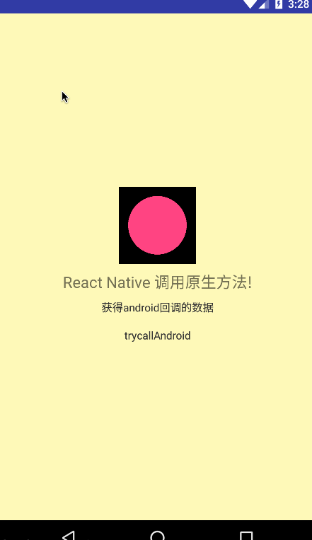

### React Native使用原生UI组件

#### 在之前的一篇文章中，我记录了已有的Android项目如何接入React Native，介绍了RN如何调用原生的方法，本篇文章上在之前的一篇的文章的基础上续写的，这一篇文章中我将记录Android如何封装原生组件，然后RN来使用它。如果对接入RN还不太了解的，可以看看我的另一篇文章 [Android原生项目接入React Native](http://blog.csdn.net/imsunlight/article/details/60756528)

> 其实，如果Android接入RN已经搞好了，这个就不难弄了，都是类似的，下面先大致介绍一下如何使用原生UI组件的，图解如下：

 

### 从图中可以很清楚地看到实现步骤，具体如何实现，下面一步一步来介绍

  * Step1 继承SimpleViewManager 代码如下：

```
public class NativePaintViewManager extends SimpleViewManager<MyPaintView> {

    public static final String REACT_CLASS = "RCTMyPaintView";


    @Override
    public String getName() {
        return REACT_CLASS;
    }

    @Override
    protected MyPaintView createViewInstance(ThemedReactContext reactContext) {
        return new MyPaintView(reactContext);
    }

    @ReactProp(name = "color")
    public void setColor(MyPaintView paintView, String color) {
        paintView.setColor(color);
    }


    @ReactProp(name = "raduis")
    public void setRaduis(MyPaintView paintView, Integer raduis) {
        paintView.setRaduis(raduis);
    }

}
```

> 说明一下，这里的SimpleViewManager<T>指定的类型为MyPaintView，这个MyPaintView就是Android自定义的一个View，我简单的画了一个圆，提供的属性有 color，raduis 分别表示圆的颜色以及半径大小，注意需要用@ReactProp注解。接下来介绍一下MyPaintView

  * step2 自定义MyPaintView的实现

```
public class MyPaintView extends View {
    /**
     * 画笔
     */
    private Paint mPaint;

    /**
     * 圆的半径
     */
    private float raduis=100;

    /**
     * view的宽和高
     */
    private int width;
    private int height;


    public MyPaintView(Context context) {
        this(context, null);
    }

    public MyPaintView(Context context, AttributeSet attrs) {
        this(context, attrs, 0);
    }

    public MyPaintView(Context context, AttributeSet attrs, int defStyleAttr) {
        super(context, attrs, defStyleAttr);

        mPaint = new Paint();
        mPaint.setColor(Color.BLUE);
        mPaint.setStrokeWidth(50);

    }

    @Override
    protected void onSizeChanged(int w, int h, int oldw, int oldh) {
        super.onSizeChanged(w, h, oldw, oldh);
        width = w;
        height = h;
    }

    @Override
    protected void onDraw(Canvas canvas) {
        super.onDraw(canvas);

        canvas.translate(width / 2, height / 2);
        canvas.drawCircle(0, 0, 100, mPaint);
    }

    /**
     * 设置颜色
     */
    public void setColor(String color) {

        mPaint.setColor(Color.parseColor(color));
        invalidate();
    }

    /**
     * 设置圆的 半径
     */
    public void setRaduis(Integer raduis) {
        this.raduis = raduis;
        invalidate();
    }
}
```

> 这里 我就简单的画了一个圆，对外提供了设置颜色跟设置半径两个方法，当RN引用这个组件的时候，就可以将这两个方法转化成对应的属性了，在js中使用就很简单了

  * step3 把这个视图管理类注册到应用程序包的createViewManagers里 在MyReactPackage中修改

```
public class MyReactPackage implements ReactPackage {

    @Override
    public List<NativeModule> createNativeModules(ReactApplicationContext reactContext) {

        List<NativeModule> modules = new ArrayList<>();
        //将我们创建的类添加进原生模块列表中
        modules.add(new MyNativeModule(reactContext));
        return modules;
    }


    @Override
    public List<Class<? extends JavaScriptModule>> createJSModules() {

        //返回值需要修改
        return Collections.emptyList();
    }


    @Override
    public List<ViewManager> createViewManagers(ReactApplicationContext reactContext) {

        //返回值需要修改
//        return Collections.emptyList();

        // 因为自定义的原生View，需要返回native的ViewManager
        return Arrays.<ViewManager>asList(new NativePaintViewManager());

    }
}
```

  * step4 定义Java和JavaScript之间的接口层  NativePaintView.js

```
import { PropTypes } from 'react';
import { requireNativeComponent, View } from 'react-native';

var iface = {
  name: 'RCTMyPaintView',
  propTypes: {

    color: PropTypes.string,
    raduis: PropTypes.number,
    ...View.propTypes // 包含默认的View的属性
  },
};

module.exports = requireNativeComponent('RCTMyPaintView', iface);
```

> 注意在这里需要指定color、raduis的属性，分别用PropTypes.string跟PropTypes.number表示，这样的话，在别的地方就可以引用这个组件了

  * step5 使用这个组件

```
    //导入组件
    import PaintView from './NativePaintView';

    // 使用
     <PaintView style={styles.paintview}
                               color={"#FF5984"}
                               raduis={100}
                    />
```


#### 最后看下效果：




